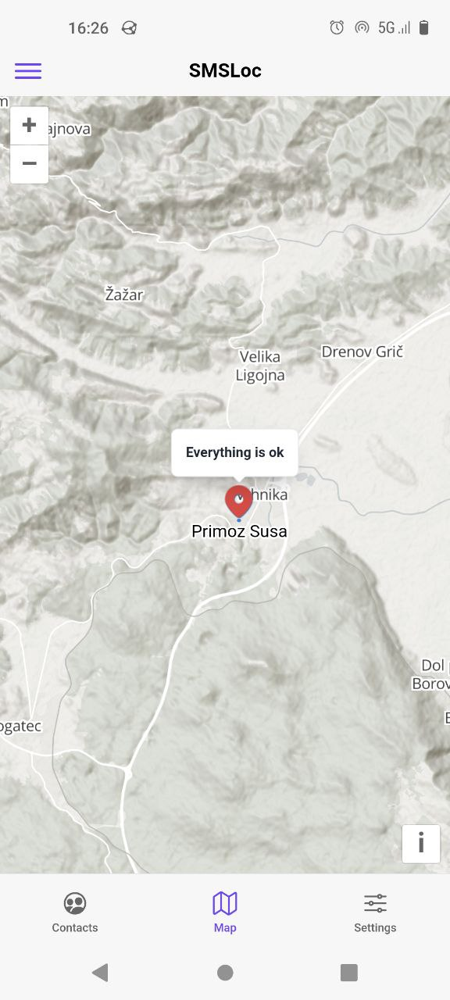
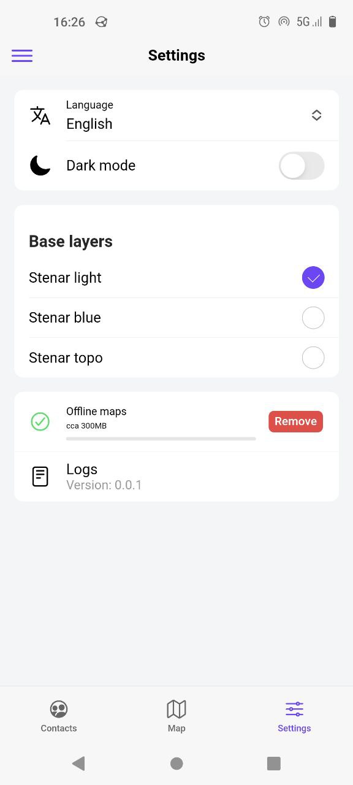
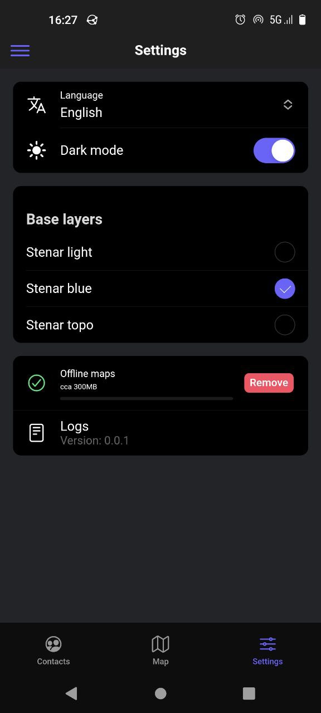
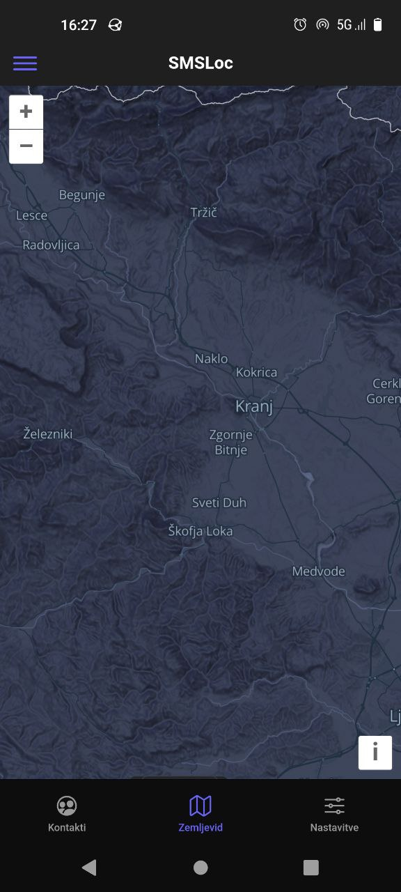

# SMSLoc

## About

Locate your friend and be found via SMS in areas with no internet or poor connectivity.

### Offline

SMSLoc can be used offline by whitelisted friends to check each other's exact location at any time. It is designed for outdoor use when hiking, climbing, canyoning, paragliding etc.

SMSLoc requires SMS and background location permission so that it can always respond hands-free to an SMS request with the exact location while the user is engaged in their outdoor activity or being in distress.

### Need help

Send short, predefined messages **along with your location**.

## Screenshots

<div align="center">  
  
  
  
</div>

<div align="center">
  
  
  
</div>

## configuration

All configurations are located in `/config` folder.
Replace `/config/prod/*` files as shown in .example.ts.

- [capacitor docs](https://capacitorjs.com/docs)
- [native applications configurations "trapeze"](https://trapeze.dev/)

## dev

### ui development

```sh
yarn ionic-serve
```

### build and run in android studio

```sh
yarn ionic-sync
yarn ionic-cap-open-android

# run the app in android studio
# debug in android studio, check logcat or in browser brave://inspect
```

### build and run in android directly

```sh
ionic capacitor run android
yarn ionic-capacitor-run-android
```

### android run and live reload

```sh
yarn ionic-sync
yarn ionic-serve

# make sure device is visible adb devices
# then copy the external app address and run
# brave://inspect/#devices and set portforward 8100

yarn ionic-live-reload
# example command
# ionic cap run android --livereload-url=http://localhost:8100
```

### test hardware device connection

```sh
adb device
native-run android --list
```

## Build release apk or playstore

- [docker compile instructions](/deploy/docker/README.md)

- [generate release article](https://ionicframework.com/docs/deployment/play-store)
- [sign release apk article](https://developer.android.com/studio/publish/app-signing)

### Donate


<div align="left">
  
</div>
