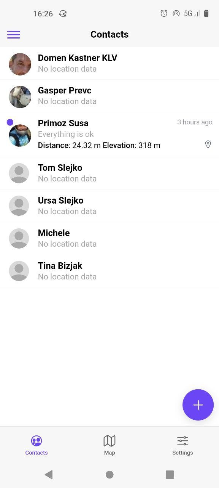
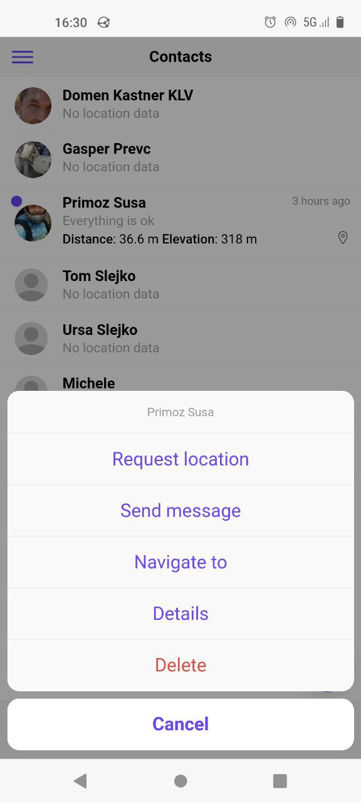

# SMSLoc

## About

SMSLoc can be used by friends to check each other's location in areas with poor internet connection, or to locate a lost phone with the help of a friend.

## Screenshots

<div align="center">
  
  
  
</div>

<div align="center">
  
  
  
</div>

## configuration

All configurations are located in `/config` folder.
Replace `/config/prod/*` files as shown in .example.ts.

- [capacitor docs](https://capacitorjs.com/docs)
- [native applications configurations "trapeze"](https://trapeze.dev/)

## dev

### ui development

```sh
yarn ionic-serve
```

### build and run in android studio

```sh
yarn ionic-sync
yarn ionic-cap-open-android

# run the app in android studio
# debug in android studio, check logcat or in browser brave://inspect
```

### build and run in android directly

```sh
ionic capacitor run android
yarn ionic-capacitor-run-android
```

### android run and live reload

```sh
yarn ionic-sync
yarn ionic-serve

# make sure device is visible adb devices
# then copy the external app address and run
# brave://inspect/#devices and set portforward 8100

yarn ionic-live-reload
# example command
# ionic cap run android --livereload-url=http://localhost:8100
```

### test hardware device connection

```sh
adb device
native-run android --list
```

## Build release apk or playstore

- [docker compile instructions](/deploy/docker/README.md)

- [generate release article](https://ionicframework.com/docs/deployment/play-store)
- [sign release apk article](https://developer.android.com/studio/publish/app-signing)
